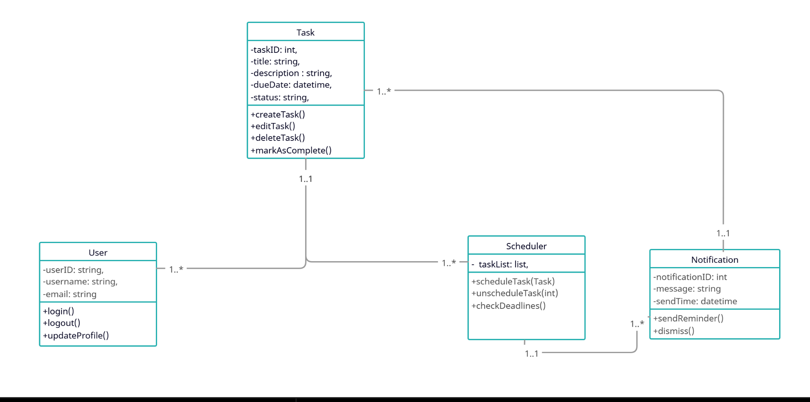

## User Interface Specification

### Navigation Diagram


### Class Diagram


Description: The class diagram shows the relationship between four different classes 
             that we will code: user, task, scheduler and notification. All classes 
             have at least one association with another class. The user class represents
             the person interacting with the system by adding/deleting tasks as well as 
             receiving any new notification. The task class contains important information
             such as the title,description and due date. The scheduler class handles timing 
             and logic. Lastly, the notification class will serve to send priorities to the
             user.
### Screen Layouts

#### Main Menu

```text
========== TASK SCHEDULER ==========
1. Create Task
2. View Tasks
3. Edit Task
4. Delete Task
5. Manage Subtasks
6. Mark Task Complete
7. Sort Tasks
8. View Overdue Tasks
9. Generate Schedule
10. Save Tasks
11. Load Tasks
12. Undo Last Action
13. Exit

Enter your choice: _
```

**Description:**  
The Main Menu is the starting point of the program. The user selects an option by entering a number.

---

#### Create Task Screen

```text
========== CREATE TASK ==========
Task Title: Complete Research Summary
Description: Write a short summary of research notes
Category: School
Deadline (MM/DD/YYYY): 06/15/2026
Priority Level (1-5): 4
Estimated Completion Time (minutes): 75

Create this task? (y/n): _
```

**Description:**  
The Create Task screen allows the user to enter the information needed to create a new task.

---

#### View Tasks Screen

```text
========== VIEW TASKS ==========
ID | Task Title                 | Deadline   | Priority | Time | Status
--------------------------------------------------------------------------
1  | Complete Research Summary  | 06/15/2026 | 4        | 75m  | Incomplete
2  | Clean Workspace            | 06/12/2026 | 2        | 30m  | Complete
3  | Prepare Presentation       | 06/18/2026 | 5        | 120m | Incomplete

Enter task ID to view details, or 0 to return: _
```

**Description:**  
The View Tasks screen displays all tasks in a table format. The user can quickly see each task’s deadline, priority level, estimated time, and completion status.

---

#### Task Details Screen

```text
========== TASK DETAILS ==========
Task ID: 1
Title: Complete Research Summary
Description: Write a short summary of research notes
Category: School
Deadline: 06/15/2026
Priority Level: 4
Estimated Time: 75 minutes
Status: Incomplete

Subtasks:
1. Review notes
2. Write rough draft
3. Proofread final summary

Press Enter to return to View Tasks.
```

**Description:**  
The Task Details screen shows the full information for one selected task. If the task has subtasks then it would show underneath the main task.

---

#### Edit Task Screen

```text
========== EDIT TASK ==========
Select task ID to edit: 1

Current Task: Complete Research Summary

1. Edit Title
2. Edit Description
3. Edit Category
4. Edit Deadline
5. Edit Priority Level
6. Edit Estimated Time
7. Return to Main Menu

Enter your choice: _
```

**Description:**  
The Edit Task screen allows the user to update an existing task by selecting which part they would like to change.

---

#### Delete Task Screen

```text
========== DELETE TASK ==========
Select task ID to delete: 2

Task Selected: Clean Workspace
Deadline: 06/12/2026
Priority Level: 2

Are you sure you want to delete this task? (y/n): _
```

**Description:**  
The Delete Task screen allows the user to remove a task from the task list. A confirmation prompt is shown before deletion in case they made a mistake and they don't want to end up deleting that task.

---

#### Manage Subtasks Screen

```text
========== MANAGE SUBTASKS ==========
Parent Task: Prepare Presentation

Current Subtasks:
1. Create slide outline
2. Add visuals
3. Practice speaking notes

1. Add Subtask
2. Edit Subtask
3. Delete Subtask
4. Mark Subtask Complete
5. Return to Main Menu

Enter your choice: _
```

**Description:**  
The Manage Subtasks screen allows the user to create and manage subtasks under a parent task. A parent task is not considered complete until all of its subtasks are completed.

---

#### Mark Task Complete Screen

```text
========== MARK TASK COMPLETE ==========
Select task ID to mark complete: 3

Task Selected: Prepare Presentation

All subtasks completed? No

This task cannot be marked complete until all subtasks are finished.
Press Enter to return to Main Menu.
```

**Description:**  
The Mark Task Complete screen allows the user to update a task’s completion status. If the task has unfinished subtasks then it would not be allowed to mark as complete until every subtask has been completed.

---

#### Sort Tasks Screen

```text
========== SORT TASKS ==========
1. Sort by Earliest Deadline
2. Sort by Highest Priority
3. Sort by Estimated Completion Time
4. Sort by Completion Status
5. Return to Main Menu

Enter your choice: _
```

**Description:**  
The Sort Tasks screen allows the user to organize tasks using different criteria. Tasks can be sorted by categories like deadline, priority, estimated completion time, or completion status.

---

#### View Overdue Tasks Screen

```text
========== OVERDUE TASKS ==========
Current Date: 06/20/2026

ID | Task Title                 | Deadline   | Priority | Status
----------------------------------------------------------------
1  | Complete Research Summary  | 06/15/2026 | 4        | Incomplete

Press Enter to return to Main Menu.
```

**Description:**  
The View Overdue Tasks screen displays incomplete tasks whose deadlines have already passed. This helps the user quickly identify tasks that need immediate attention.

---

#### Generate Schedule Screen

```text
========== GENERATED SCHEDULE ==========
Scheduling Method:
1. Earliest deadline first
2. Higher priority first if deadlines are equal
3. Shorter estimated time first if deadline and priority are equal

Today's Agenda:
1. Complete Research Summary - Due: 06/15/2026 - Priority: 4 - Time: 75m
2. Prepare Presentation - Due: 06/18/2026 - Priority: 5 - Time: 120m
3. Clean Workspace - Due: 06/12/2026 - Priority: 2 - Time: 30m

Press Enter to return to Main Menu.
```

**Description:**  
The Generate Schedule screen displays a suggested order for completing tasks. The scheduling algorithm prioritizes tasks by earliest deadline, then highest priority, and then shortest estimated completion time.

---

#### Save Tasks Screen

```text
========== SAVE TASKS ==========
Saving task data to file...

File name: tasks.txt

Tasks saved successfully.
Press Enter to return to Main Menu.
```

**Description:**  
The Save Tasks screen stores the user’s task list in a file. This allows task data to be preserved after they decide to end the program.

---

#### Load Tasks Screen

```text
========== LOAD TASKS ==========
Loading task data from file...

File name: tasks.txt

Tasks loaded successfully.
Press Enter to return to Main Menu.
```

**Description:**  
The Load Tasks screen reads saved task data from a file. This allows the user to continue working with previously saved tasks.

---

#### Undo Last Action Screen

```text
========== UNDO LAST ACTION ==========
Last Action: Deleted task "Clean Workspace"

Undo this action? (y/n): _
```

**Description:**  
The Undo Last Action screen allows the user to reverse the most recent change. This supports actions such as undoing a task creation, edit, deletion, or completion update so that they don't regret their decision.
